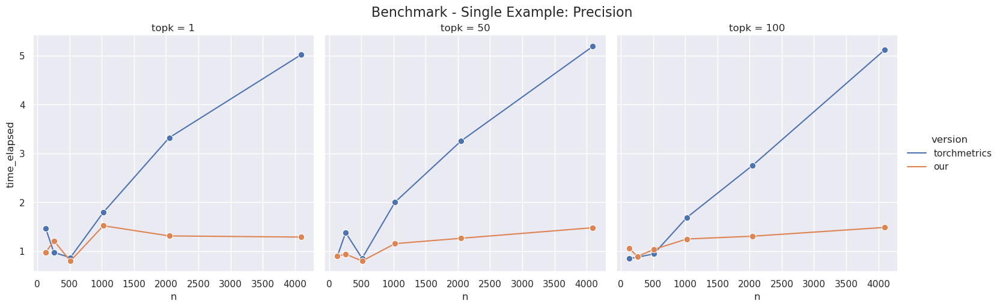
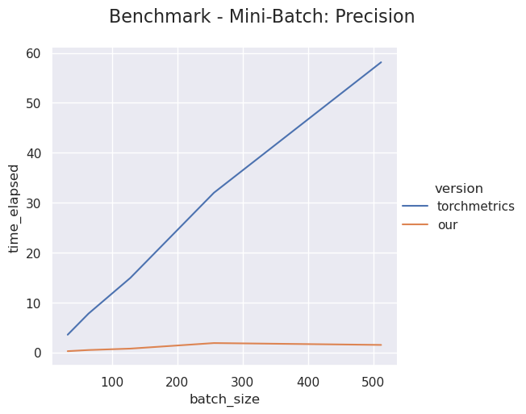
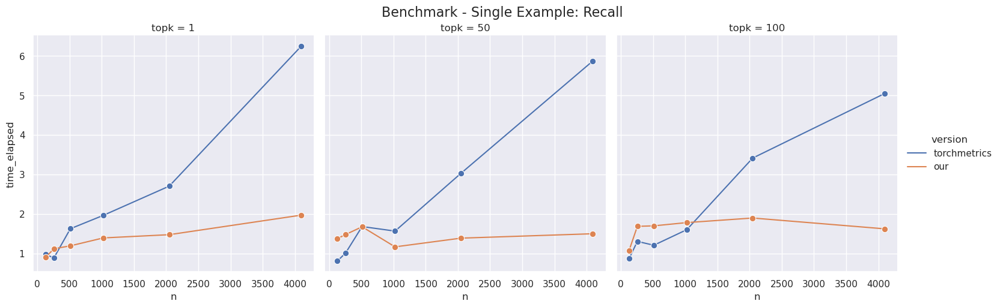
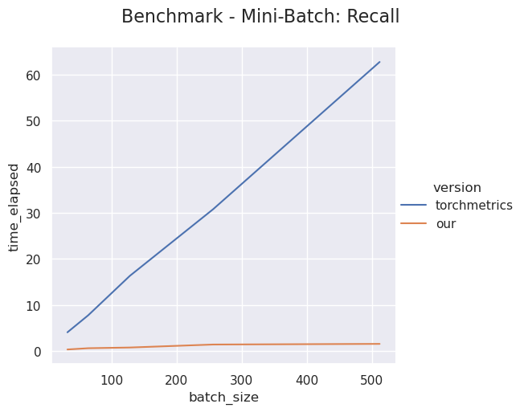
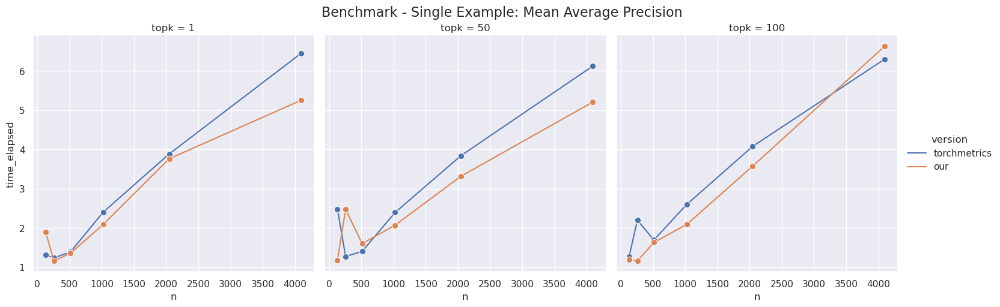
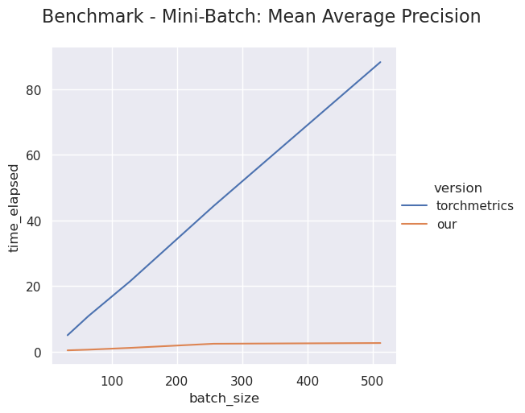
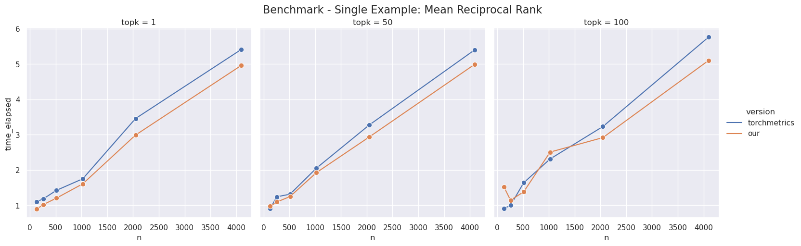
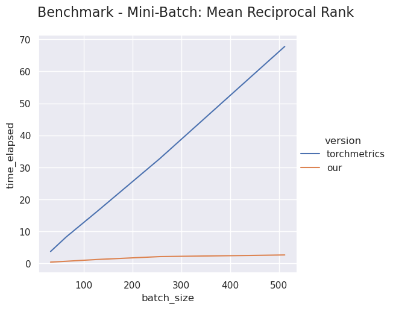
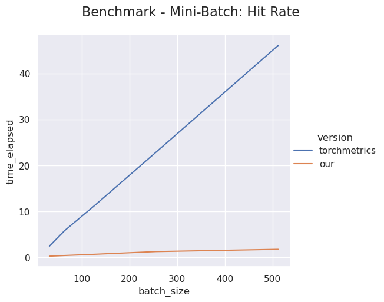
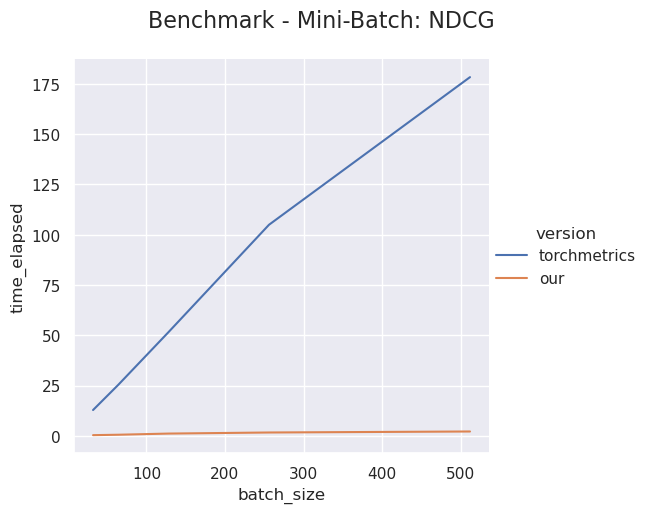

<div align="center">

<p align='center'><b>recsys_metrics</b></p>

**An efficient PyTorch implementation of the evaluation metrics in recommender systems.**

______________________________________________________________________

<p align="center">
  <a href="#Overview">Overview</a> •
  <a href="#Installation">Installation</a> •
  <a href="#How-to-use">How to use</a> •
  <a href="#Benchmark">Benchmark</a> •
  <a href="#Citation">Citation</a> •
</p>

______________________________________________________________________

</div>

## Overview

### Why do we need `recsys_metrics`?
### Highlights
- Efficient (vectorized) implementations over mini-batches.
- Standard RecSys metrics: precision, recall, map, mrr, hr, ndcg, $\alpha$-ndcg
- Beyond-accuracy metrics: coverage, diversity, novelty, serendipity, etc.
- All metrics support a top-k argument.

## Installation

You can install `recsys_metrics` from PyPI:

```bash
pip install recsys_metrics
```

Or you can also install the latest version from source:

```bash
pip install git+https://github.com/zuoxingdong/recsys_metrics.git@master
```

Note that we support Python 3.7+ only.

## How to use

### Hit Rate
Let us take Hit Rate (HR) to illustrate how to use this library:

```python
preds = torch.tensor([
    [.5, .3, .1],
    [.3, .4, .5]
])
target = torch.tensor([
    [0, 0, 1],
    [0, 1, 1]
])
hit_rate(preds, target, k=1, reduction='mean')

>> tensor(0.5000)
```
The first example in the batch does not have a hit (i.e. top-1 item is not a relevant item) and second example in the batch gets a hit (i.e. top-1 item is a relevant item). Thus, we have a hit-rate of 0.5.

The API of other metrics are of the same format.

### Serendipity
Let us calculate serendipity:

```python
preds = torch.tensor([
    [.5, .3, .1],
    [.3, .4, .5]
])
indexes = torch.tensor([
    [1, 2, 3],
    [4, 5, 6]
])
target = torch.tensor([
    [0, 1, 1],
    [0, 1, 1]
])
```

Suppose we are given the following tensors for the category of items and historical interactions for each example in the mini-batch:

```python
item_category = torch.tensor([
    [2, 1, 8],
    [3, 9, 4]
])
hist_seq_category = torch.tensor([
    [5, 0, 1, 2, 3, 0, 4],
    [1, 3, 6, 0, 2, 3, 5]
])
```

Then, we could use a helper function provided in this library to calculate a tensor of unexpectedness (or surprise) with a window size of the most recent interactions:

```python
unexpectedness = category_unexpectedness(
  item_category, 
  hist_seq_category=hist_seq_category[:, None, :].tile(1, 3, 1), 
  window_size=3
)
```

Finally, let us calculate the serendipity:

```python
serendipity(preds, target, unexpectedness, k=3, reduction='mean')

>> tensor(0.6667)
```

### Report functions

This library also offers report functions to conveniently calculate standard IR metrics or beyond-accuracy metrics in an one-liner style.

```python
rank_report(
    preds=preds, 
    target=target, 
    k=None, 
    to_item=True, 
    name_abbreviation=True,
    rounding=4,
)

>> {'prec': 0.5,
 'rec': 1.0,
 'map': 0.6667,
 'mrr': 0.6667,
 'hr': 1.0,
 'ndcg': 0.75}
```

```python
beyond_accuracy_report(
    preds=preds,
    indexes=indexes,
    k=None,
    to_item=True,
    name_abbreviation=True,
    target=target,
    unexpectedness=unexpectedness.long(),
    rounding=4,
)

>> {'cat_cov': 1.0,
 'dist_cov': 1.0,
 'mil': 1.0,
 'serend': 0.6667}
```


## Benchmark

| Metrics | Single Example | Mini-Batch |
| :---:  | :---: | :---: |
| Precision |  |  |
| Recall |  |  |
| MAP |  |  |
| MRR |  |  |
| HR |  |  |
| NDCG |  |  |

## Citation

This work is inspired by [Torchmetrics](https://github.com/PyTorchLightning/metrics) from PyTorchLightning Team.

Please use this bibtex if you want to cite this repository in your publications:

    @misc{recsys_metrics,
          author = {Zuo, Xingdong},
          title = {recsys_metrics: An efficient PyTorch implementation of the evaluation metrics in recommender systems.},
          year = {2021},
          publisher = {GitHub},
          journal = {GitHub repository},
          howpublished = {\url{https://github.com/zuoxingdong/recsys_metrics}},
        }
